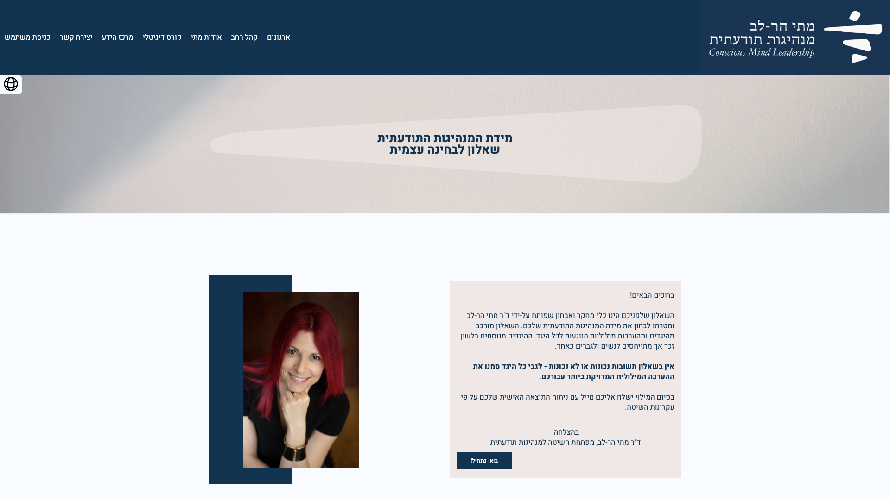

# matis-leadership-quiz

## Installation
git clone: https://github.com/eytanSilberberg/matis-leadership-quiz.git
Visit app at: https://analysis.matiharlev.com/

A Real live project that was developed and designed by me for Mati Harlev, who is a psychologist that developed a questionnaire that its main purpose is to grade a persons conscious leadership.

You can visit her website at: https://www.matiharlev.com/

this project is built with React and Nodejs, and uses the following libraries, styles and apis:  

- *MongoDb:* A database which collects in this project  all users who filled the form(connected through the backend)
- *scss:* The main style language in this project
- *mui:* A  Library which gives us access (in this project) to pre made components.
- *flag-icons:* A library of flags of different countries.
- *i18next:* A library which allows an easy way of translating your app to different languages.
- *axios:*  A promise based HTTP Client for nodejs and the browser(A definition from axios docs).
- *sendGrid:* A platform which allows us to easily send beautiful designed emails to different users. This library is api based and used in the backend of this project.

This project is can be viewed in all screen sizes: from a small screen of a phone up until a large screen of a computer

