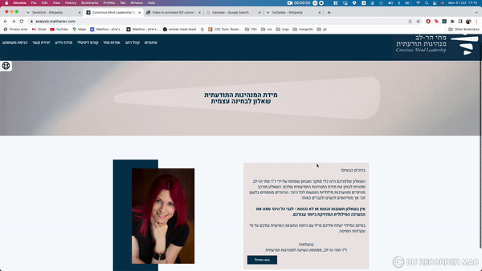
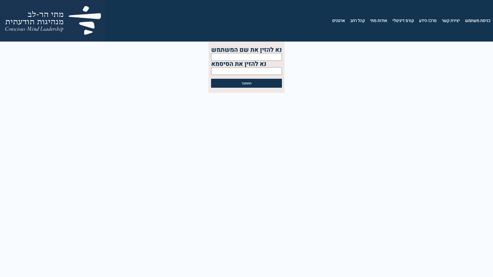

# matis-leadership-quiz


## Installation
git clone: https://github.com/eytanSilberberg/matis-leadership-quiz.git
<br/>
Visit app at: https://analysis.matiharlev.com/
<hr/>
<br/>

A Real live project that was developed and designed by me for Mati Harlev, who is a psychologist that developed this questionnaire that its soul purpose is to help people understand what is conscious leadership and what they should do to improve their own.
<br/>
<br/>

At the end of the experience the user will receive an email containing a more elaborate explanation of what is conscious leadership, and an analysis which will guide and help them improve in the matter. 

<br/>
<br/>


This project is built with React and Nodejs, stored in heroku paid dynos, uses goDaddy as its domain provider and uses the following libraries and apis: <br/>

- *MongoDb:* A database which collects in this project  all users who filled the form(connected through the backend)
- *scss:* The main style language in this project
- *mui:* A  Library which gives us access (in this project) to pre made components.
- *flag-icons:* A library of flags of different countries.
- *i18next:* A library which allows an easy way of translating your app to different languages.
- *axios:*  A promise based HTTP Client for nodejs and the browser(A definition from axios docs).
- *sendGrid:* A platform which allows us to easily send beautiful designed emails to different users. This library is api based and used in the backend of this project.

This project can be viewed in all screen sizes: from a small screen of a phone, up until a large screen of a computer

<p float='left'>


</p>


By using mui components I was able to create the progress bar that sticks to the top of the page. Once the user finishes answering all questions there is a color indicator which lets them know if any questions weren't answered.


In the end, the user will fill out a details form, and once finished he'll be redirected to Matis official website, and they will receive an email  containing the analysis of the questionnaire that was filled. As you can see, the email received is also suitable to all screen sizes.

Another feature that is included in this app is the option to change the language of the app. The primary language of this app is hebrew but is also compatible in English( Not all features are currently working in the app in english for the reason of the owner still working on translating the entire site). 



```js
import i18n from "i18next";
import { initReactI18next } from "react-i18next";
import LanguageDetector from 'i18next-browser-languagedetector'

import translationEn from '../../assets/locales/en/translationEn.json'
import translationHe from '../../assets/locales/he/translationHe.json'

const resources = {
    en: {
        translation: translationEn
    },
    he: {
        translation: translationHe
    }
}

i18n
    .use(initReactI18next) 
    .init({
        resources,
        lng: 'he', 
        fallbackLng: "he",
        interpolation: {
            escapeValue: false 
        }
    });

export default i18n;
```

This service runs straight as the app runs.
A very easy library which helped me a lot with translating the app


Two more pages are included in this app, Which are only relevant to the admin of this app.

These two pages are not translated to other languages and won't be translated, for the reason of the admins primary language being hebrew.

page 1- Login page:



Page 2- Analysis page(Which is an inner route)


In the coming future there will be a full crud regarding the questions that are presented to the users, and the admin will be able to decide on them(As you can see in there are two pages available in the backOffice page)

For privacy reasons all emails and analysis will be filtered out expect of my own.

Hope you enjoy the app !


