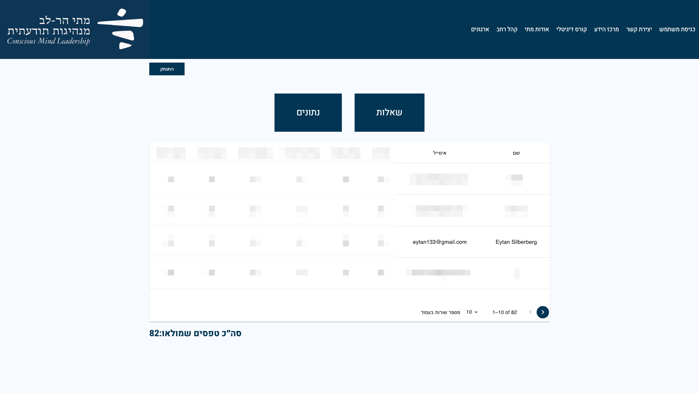

# matis-leadership-quiz

## Installation
git clone: https://github.com/eytanSilberberg/matis-leadership-quiz.git
 
Visit app at: https://analysis.matiharlev.com/

 

A Real live project that was developed and designed by me for Mati Harlev, who is a psychologist that developed a questionnaire that its soul purpose is to help people understand what is conscious leadership and what they should do to improve their own.
 
 

at the end of the experience the user will receive an email containing a more elaborated explanation of what is conscious leadership, and an analysis which will guide and help them improve in the matter. 

 
 

This project is built with React and Nodejs, stored in heroku paid dynos, uses goDaddy as its domain provider and uses the following libraries and apis:  

- *MongoDb:* A database which collects in this project  all users who filled the form(connected through the backend)
- *scss:* The main style language in this project
- *mui:* A  Library which gives us access (in this project) to pre made components.
- *flag-icons:* A library of flags of different countries.
- *i18next:* A library which allows an easy way of translating your app to different languages.
- *axios:*  A promise based HTTP Client for nodejs and the browser(A definition from axios docs).
- *sendGrid:* A platform which allows us to easily send beautiful designed emails to different users. This library is api based and used in the backend of this project.

This project can be viewed in all screen sizes: from a small screen of a phone, up until a large screen of a computer

By using mui components I got the create the progress bar the sticks to the top. Once the user finishes answering all the question there is a color indicator which lets you know that you haven't missed any question.

In the end, the user will fill up a detail form, and once finished he'll be redirected to Matis official website, and he will receive an email that contains the analysis of the questionnaire the he had filled. As you can see that the  email received is also suitable to all screen sizes.

Another feature that is included in this app is the option to change the language of the app. The primary language of this app is hebrew but is  also compatible in English( Not all features are currently working in the app in english for the reason of the owner still working on translating the entire site). 

Two more pages are included in this app, Which are only relevant to the admin of this app.

These two pages are not translated to other languages and wont be translated, for the reason of the admins primary language being hebrew.

page 1- Login page:

Page 2- Analysis page(Which is an inner route)

For privacy reasons all emails filled and analysis will be filtered out 

Hope you enjoy the app !

